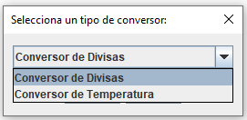
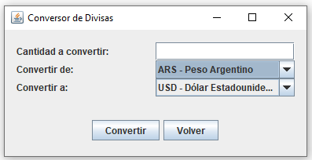
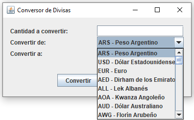
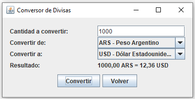
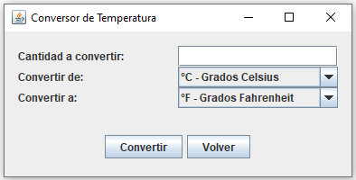
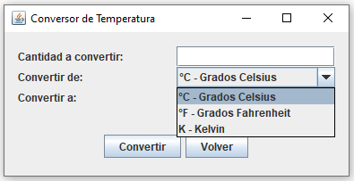
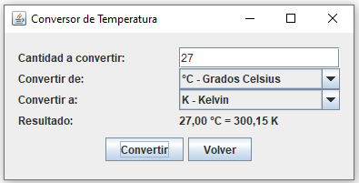

# Conversor - Java

Este es un proyecto que implementa un conversor de divisas y temperaturas en Java. Permite convertir entre diferentes unidades de divisas y temperaturas de manera sencilla y eficiente.

## Características

- Conversión de divisas entre una variedad de monedas internacionales.
- Conversión de temperaturas entre diferentes escalas (Celsius, Fahrenheit, Kelvin).
- Interfaz gráfica de usuario (GUI) intuitiva para una fácil interacción.
- Posibilidad de seleccionar las unidades de origen y destino.
- Precisión de resultados con formato adecuado.

## Capturas de Pantalla

### Pantalla Principal

### Conversor de Divisas

### Conversor de Temperatura

## Uso

1. Ejecuta la aplicación desde la clase `Principal` para acceder al menú de selección del conversor.
2. Elige entre "Conversor de Divisas" o "Conversor de Temperatura".
3. En la interfaz gráfica ingresa las cantidades y selecciona las unidades de conversión.
4. Haz clic en el botón "Convertir" para obtener los resultados o en el botón "Volver" para retornar a la pantalla principal.

## Autores

* **Natalia Albornoz** - _Autor principal_ - [NatyAlbornoz](https://github.com/NatyAlbornoz)

## Créditos

-Para el conversor de divisas, se utiliza la API de cambio.today, disponible en https://cambio.today/api (Última actualización: 2020-11-28).